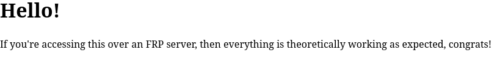

# Simple HTTP Server

This example takes a simple server which serves a single HTML file, and exposes it via FRP.

To try this example, run the following from the root of the repository:

```bash
go run ./examples/simple <frp server> <token> <subdomain>
```

For example,

```bash
go run ./examples/simple frp.mydomain.com abc123 testsite
```

And then navigate to `testsite.frp.mydomain.com`. If everything is working, you
should see something like the following:


